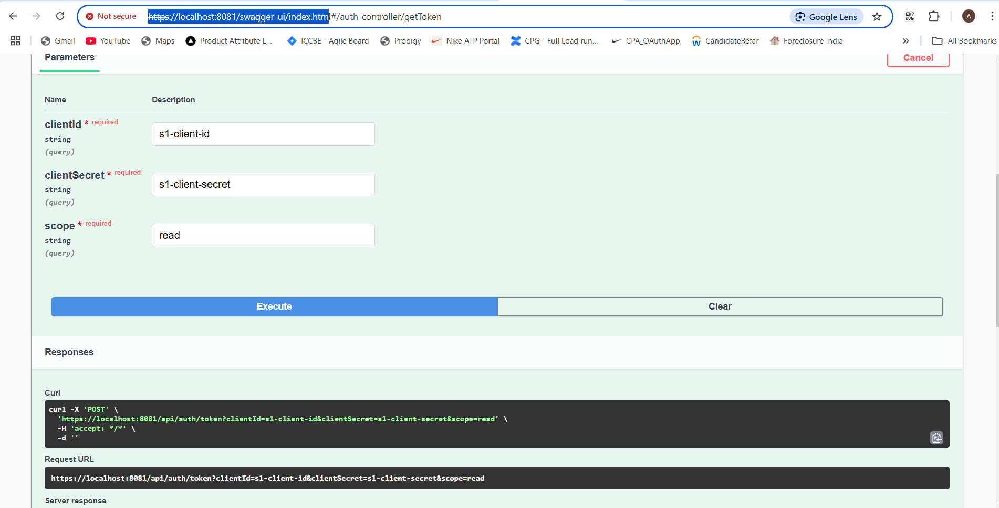

Here is the step to run

`Build the project`

PS D:\AuthServer\auth-server> ./gradlew clean build

PS D:\AuthServer\auth-server>  cd \auth-server\src\main\resources>

`Import certificate in cacerts`

PS D:\DemoSecurityApp\demo-security-app> keytool -importkeystore -srckeystore D:\DemoSecurityApp\demo-security-app\src\main\resources\demosecurity.p12 -srcstoretype PKCS12 -destkeystore "C:\JAVA\jdk-17.0.12\lib\security\cacerts" -deststoretype JKS -storepass changeit

`Run Auth Server`
./gradlew bootRun --args='--admin.username=admin --admin.password=admin123'
./gradlew bootRun

`Register Client Services in Auth Server`

AuthServerConfig ===> registeredClientRepository

add the below inside method

` RegisteredClient s1Client = RegisteredClient.withId(UUID.randomUUID().toString())
.clientId("s1-client-id")
.clientSecret(encodedSecret1) // Proper encoding
.clientAuthenticationMethod(ClientAuthenticationMethod.CLIENT_SECRET_BASIC)
.authorizationGrantType(AuthorizationGrantType.CLIENT_CREDENTIALS)
//                .authorizationGrantType(AuthorizationGrantType.REFRESH_TOKEN)
.tokenSettings(TokenSettings.builder()
.accessTokenTimeToLive(Duration.ofMinutes(30))
.refreshTokenTimeToLive(Duration.ofHours(2))
.build())
.scopes(scopes -> {
scopes.add("read");
scopes.add("create");
scopes.add("update");
scopes.add("delete");
})
.clientSettings(ClientSettings.builder().requireAuthorizationConsent(false).build())
.build();

Add s1Client in InMemoryRegisteredClientRepository(s1Client); `

`After Adding This Client Services also needs to know who is auth server `

Add the below class in Client Service

package com.org.security.config;

import org.springframework.context.annotation.Bean;
import org.springframework.context.annotation.Configuration;
import org.springframework.security.config.annotation.method.configuration.EnableMethodSecurity;
import org.springframework.security.config.annotation.web.builders.HttpSecurity;
import org.springframework.security.oauth2.jwt.JwtDecoder;
import org.springframework.security.oauth2.jwt.NimbusJwtDecoder;
import org.springframework.security.oauth2.server.resource.authentication.JwtAuthenticationConverter;
import org.springframework.security.oauth2.server.resource.authentication.JwtGrantedAuthoritiesConverter;
import org.springframework.security.web.SecurityFilterChain;

import java.util.List;

@Configuration
@EnableMethodSecurity
public class SecurityConfig {

    @Bean
    public SecurityFilterChain securityFilterChain(HttpSecurity http) throws Exception {
        http.authorizeHttpRequests(auth -> auth
                        .anyRequest().authenticated() // Ensure all requests require authentication
                )
                .oauth2ResourceServer(oauth2 -> oauth2.jwt(jwtConfigurer ->
                        jwtConfigurer.jwtAuthenticationConverter(jwtAuthenticationConverter()))
                );
        return http.build();
    }

    @Bean
    public JwtAuthenticationConverter jwtAuthenticationConverter() {
        JwtGrantedAuthoritiesConverter grantedAuthoritiesConverter = new JwtGrantedAuthoritiesConverter();
        grantedAuthoritiesConverter.setAuthorityPrefix("SCOPE_");
        JwtAuthenticationConverter authenticationConverter = new JwtAuthenticationConverter();
        authenticationConverter.setJwtGrantedAuthoritiesConverter(grantedAuthoritiesConverter);
        authenticationConverter.setJwtGrantedAuthoritiesConverter(jwt -> {
            List<String> audience = jwt.getClaimAsStringList("aud");
            if (audience == null || !audience.contains("s1-client-id")) {
                throw new SecurityException("Invalid token audience");
            }
            return grantedAuthoritiesConverter.convert(jwt);
        });
        return authenticationConverter;
    }

    @Bean
    public JwtDecoder jwtDecoder() {
        return NimbusJwtDecoder.withJwkSetUri("https://localhost:8081/oauth2/jwks").build();
    }
}

`Below is the Auth server URL: https://localhost:8081/oauth2/jwks`

`Below is Swgger Link https://localhost:8081/swagger-ui/index.htm`

`clientId: s1-client-id`
`clientSecret: s1-client-secret`
`scope: read, delete, update, create`

